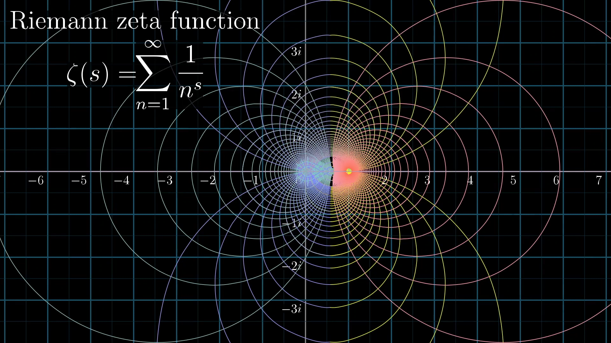

# Sonic and Visual Exploration of the Riemann Zeta Function
Ziji Zhou |
Professor Zhang, Math-345 Complex Analysis
## Introduction and Motivation
The Riemann Zeta function $\zeta(s)$ holds a place in mathematical lore. Most famously, the analytic continuation of the Riemann Zeta function holds the question to one of the Millennial questions: The Riemann Hypothesis, which we will prove...


...just kidding that will be left as an exercise for the reader :)


Instead I want to explore the magical properties of the function sonically, whilst supported by graphical information to hear and see exactly what is happening with this important function. One can easily imagine with the graph below that the Riemann Zeta function possesses some beautiful symmetries.

<p align="center">
  
</p>

The idea is to create something beautiful, representative, and generative. I have always been fascinated by systemically generative music (think modular systems) and I want to truly utilize the properties of the Riemann Zeta function within the soul of the system.

I will be utilizing a software called PureData (commonly abbreviated as pd) which is "an open source visual programming language for multimedia" made by Miller Puckett. pd provides for a more intuitive way of creating a sound system from scratch. Of course, for the more complex (pun intended) element of the project I will be using Python which I can send packets of information into pd in real time. I will also use the matplot library to show visualize what we're hearing. Lastly of course this site is written in MD on Github Pages. All of the code and snippets mentioned and written are all up on this repo (https://github.com/zijiamherst/complexFinal).

## The Function

There are a few things especially of the Riemann Zeta function that I was curious to explore. Let's try to understand them purely mathematically first (with a lot of handwaving involved).


Let's start with the function itself:
$$\zeta(s) = \sum_{n=1}^{\infty} \frac{1}{n^s}, \text{Re}(s) > 1$$

### Convergence

Limiting us to $\text{Re}(s) > 1$, we will now prove that the Riemann Zeta is convergent. We see that 
$$\frac{1}{n^s} \leq \frac{1}{n^{1+\epsilon}}, \epsilon > 0$$
Thus by the Comparison test if 
$$\sum_{n=1}^{\infty} \frac{1}{n^{1+\epsilon}}$$
is convergent then $\zeta(s)$ is convergent too. Let $M_n = \frac{1}{n^{1+\epsilon}}$, then we see
$$\sum_{n=1}^{\infty} \frac{1}{n^{1+\epsilon}} = \zeta(1+\epsilon) \leq 1+\frac{1}{\epsilon}$$
Thus by the Weierstrass M-Test, $\sum_{n=1}^{\infty} \frac{1}{n^{1+\epsilon}}$ converges, and so does the Riemann Zeta function.


### Conformal Mapping
One of the most interesting properties is that the Riemann Zeta function is a *conformal mapping*, where any angle is preserved after the function is applied.

### Analytic Continuation
We can easily see that using the previous definition of $\zeta(s) = \sum_{n=1}^{\infty} \frac{1}{n^s}$ does not converge on $\text{Re}(s) \leq 1$, however there exists a unique *analytic continuation* that extends to all of the complex plane except for a simple pole at $s = 1$. The figure below shows the continuation in blue.

<p align="center">
  
</p>

The continuation yields the following *functional equation*:
$$\zeta(1-s) = \frac{2}{{2\pi}^s} \Gamma(s) \cos{\frac{\pi s}{2}} \zeta(s)$$
Where the Gamma function can be functionally defined as $\Gamma(n) = (n-1)!$ if $n$ is real, and the integral $\int_{0}^{\infty} t^{z-1}e^{-t} \,dt$. The exact derivation of the *functional equation* is explained quite well [here](https://desvl.xyz/2022/11/24/riemann-zeta-continuation/).

## Sonic Exploration
Presented with these properties of the function's convergence, analytic continuity and subsequent zeroes, and conformal mapping, there leaves a huge variety of possibilities in its sonic representation. Here's honestly just some of my brainstorming process in creating this project. I want to build up our representation bit by bit through each of these properties.

## Convergence

Just to warm up, I think the convergence of any function is incredibly intuitive in muscical representation. In terms of cadences (ie resolving a dominant into its tonic), harmony of notes (for example moving from a tritone to a perfect fifth as the series reaches its limit), or even rhythmic patterns (polyrhythms can for example break up and then line back up over a certain time). The values themselves can also be mapped pretty straightforwardly too, there are two most obvious ways that I see fit. First are through the actual values, ie. the real and imaginary parts of the partial sums. The below code is in python calculating the Riemann Zeta function of a random $z$ with $\text{Re}(z) \in (1,3]$ and $\text{Im}(z) \in [-10,10]$.

```python
epsilon = 0.00005 
#instead of calculating the exact convergent value, we will run this until the the difference between the adjacent partial sums to be smaller than epsilon here
difference = float('inf') #initialize float at infinity
previous = 0 #initialize the previous sum

real = random.random() * -2 + 3 #the real component will be (1,3]
imaginary = int(random.random() * 21 - 10) #imag componenent an int between [-10,10]
while imaginary == 0: 
    imaginary = int(random.random() * 21 - 10) #don't want imag component to be zero
n = 1 #our little boy that will grow
while difference >= epsilon:
    z = complex(real,imaginary)
    power = z * cmath.log(n) #we calculate the power as we would in e^alpha log z form
    denom = cmath.exp(power) #this function does e^power
    
    psum = previous + 1/denom #calculate the new partial sum
    
    difference = complexMod(psum,previous) #log the difference
    previous = psum
    
    n = n+1 #increment n
```

Note how we used epsilon to determine when to stop the program by calculating the difference of each subsequent partial sum. Here are some example of the graphs of the partial sums.

<p align = "center">
  
  
</p>


