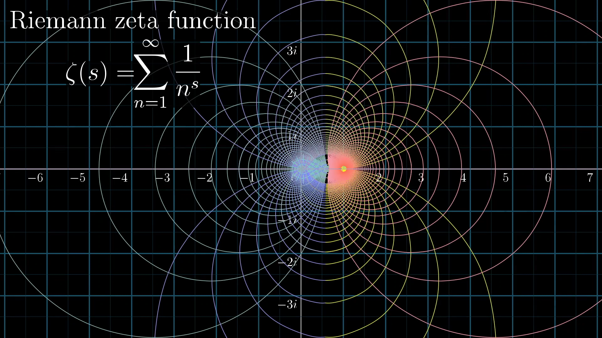
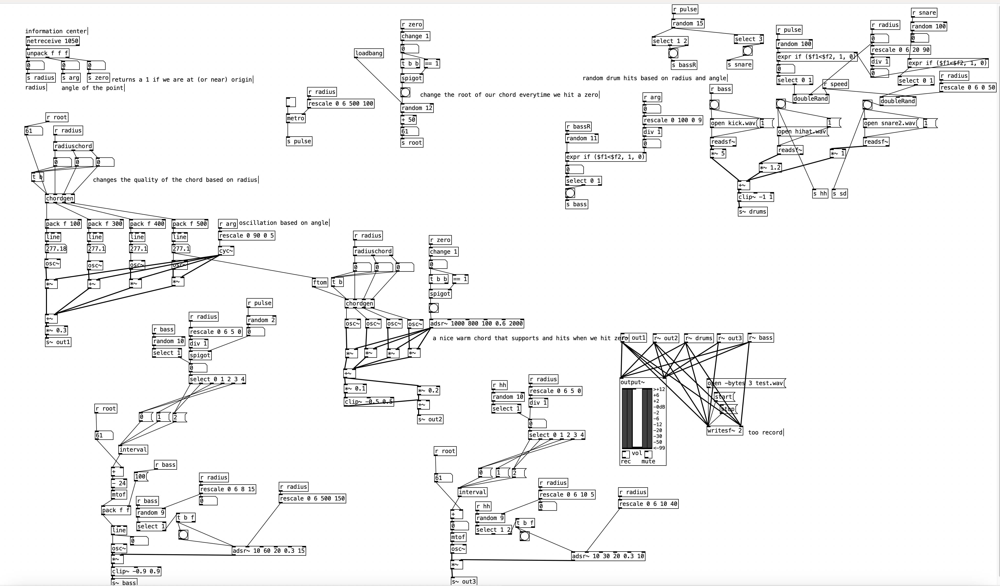
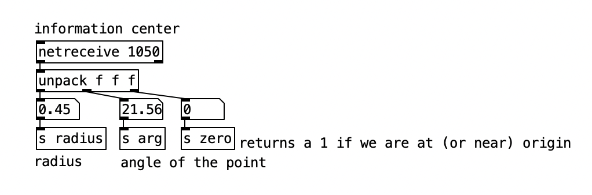
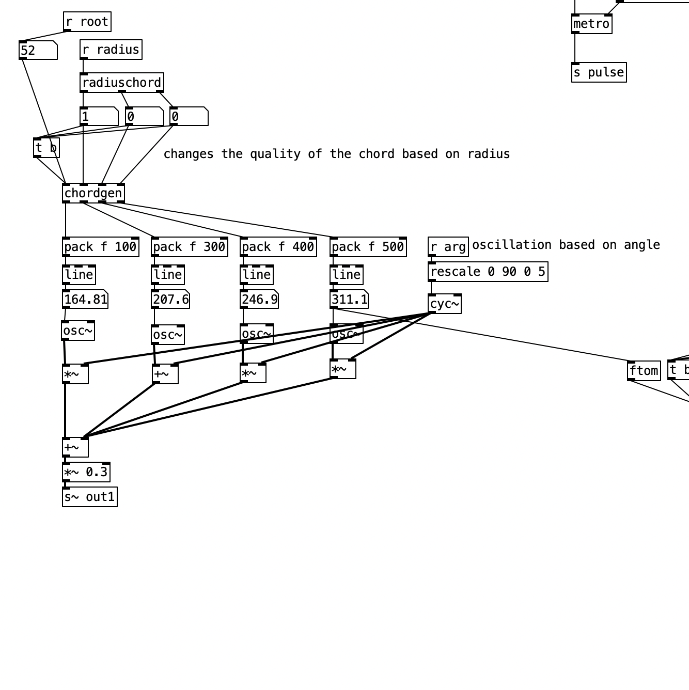
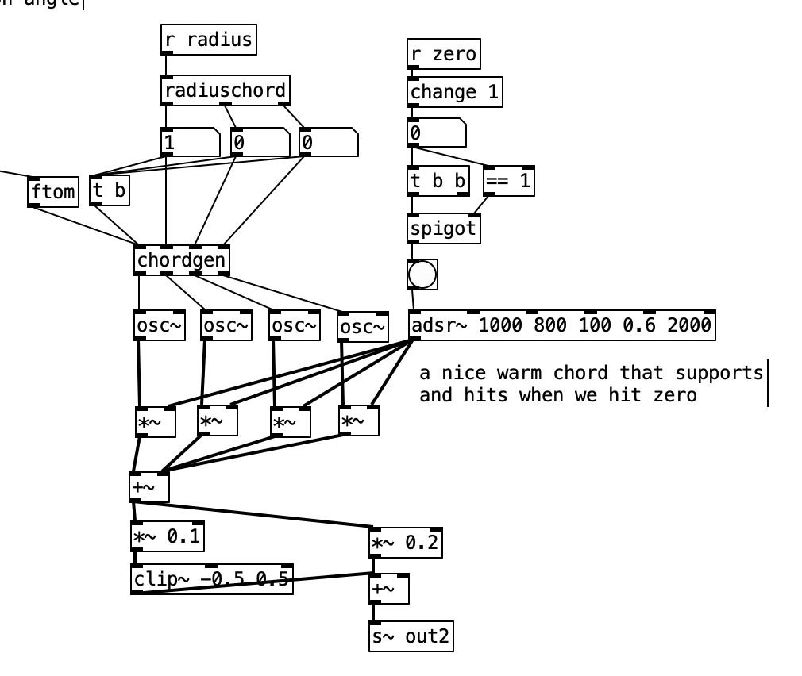
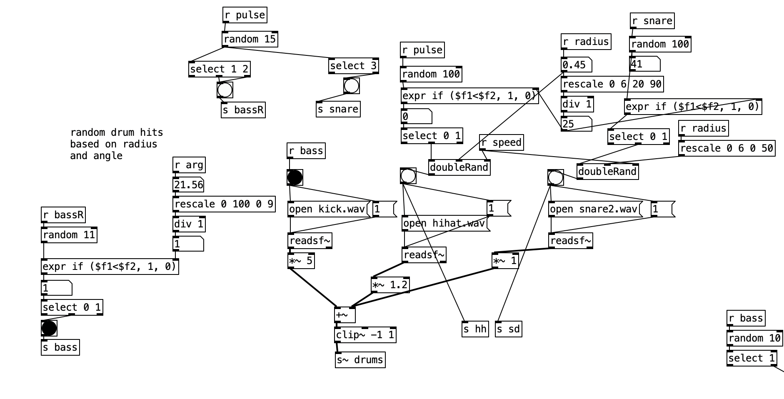

# Sonic and Visual Exploration of the Riemann Zeta Function
Ziji Zhou |  Professor Zhang, Math-345 Complex Analysis 

If you do feel too lazy to parse through this, the main result of this project is [Critical Line Sonification](https://dai.ly/x8qo4on), and you can jump to that section [here](#listening-to-the-critical-line).
## Introduction and Motivation
The Riemann Zeta function $\zeta(s)$ holds a place in mathematical lore. Most famously, the analytic continuation of the Riemann Zeta function holds the question to one of the Millennial questions: The Riemann Hypothesis, which we will prove...


...just kidding that will be left as an exercise for the reader :)


Instead I want to explore the magical properties of the function sonically, whilst supported by graphical information to hear and see exactly what is happening with this important function. One can easily imagine with the graph below that the Riemann Zeta function possesses some beautiful symmetries.

<p align="center">
  
</p>

The idea is to create something beautiful, representative, and generative. I have always been fascinated by systemically generative music (think modular systems) and I want to truly utilize the properties of the Riemann Zeta function within the soul of the system.

I will be utilizing a software called PureData (commonly abbreviated as pd) which is "an open source visual programming language for multimedia" made by Miller Puckett. pd provides for a more intuitive way of creating a sound system from scratch. Of course, for the more complex (pun intended) mathematical elements of the project I will be using Python which I can send packets of information into pd in real time. I will also use the matplot library to show visualize what we're hearing. Lastly of course this site is written in MD. All of the code and snippets mentioned and written are all up on this repo under the final folder.  Enjoy!

## The Function

There are a few things especially of the Riemann Zeta function that I was curious to explore. Let's try to understand them purely mathematically first (with a lot of handwaving involved).


Let's start with the function itself:
$$\zeta(s) = \sum_{n=1}^{\infty} \frac{1}{n^s}, \text{Re}(s) > 1$$

### Convergence

Limiting us to $\text{Re}(s) > 1$, we will now prove that the Riemann Zeta is convergent. We see that 
$$\frac{1}{n^s} \leq \frac{1}{n^{1+\epsilon}}, \epsilon > 0$$
Thus by the Comparison test if 
$$\sum_{n=1}^{\infty} \frac{1}{n^{1+\epsilon}}$$
is convergent then $\zeta(s)$ is convergent too. Let $M_n = \frac{1}{n^{1+\epsilon}}$, then we see
$$\sum_{n=1}^{\infty} \frac{1}{n^{1+\epsilon}} = \zeta(1+\epsilon) \leq 1+\frac{1}{\epsilon}$$
Thus by the Weierstrass M-Test, $\sum_{n=1}^{\infty} \frac{1}{n^{1+\epsilon}}$ converges, and so does the Riemann Zeta function.


### Conformal Mapping
One of the most interesting properties is that the Riemann Zeta function is a *conformal mapping*, where any angle is preserved after the function is applied.

### Analytic Continuation
We can easily see that using the previous definition of $\zeta(s) = \sum_{n=1}^{\infty} \frac{1}{n^s}$ does not converge on $\text{Re}(s) \leq 1$, however there exists a unique *analytic continuation* that extends to all of the complex plane except for a simple pole at $s = 1$. The figure below shows the continuation in blue.

<p align="center">
  
</p>

The continuation yields the following *functional equation*:
$$\zeta(1-s) = \frac{2} { {2\pi}^s} \Gamma(s) \cos{\frac{\pi s}{2}} \zeta(s)$$
Where the Gamma function can be functionally defined as $\Gamma(n) = (n-1)!$ if $n$ is real, and the integral $\int_{0}^{\infty} t^{z-1}e^{-t} \,dt$. The exact derivation of the *functional equation* is explained quite well [here](https://desvl.xyz/2022/11/24/riemann-zeta-continuation/).

## Sonic Exploration

Presented with these properties of the function's convergence, analytic continuity and subsequent zeroes, and conformal mapping, there leaves a huge variety of possibilities in its sonic representation. Here's honestly just some of my brainstorming process in creating this project. I want to build up our representation bit by bit through each of these properties.

### Convergence

Just to warm up, I think the convergence of any function is incredibly intuitive in muscical representation. In terms of cadences (ie resolving a dominant into its tonic), harmony of notes (for example moving from a tritone to a perfect fifth as the series reaches its limit), or even rhythmic patterns (polyrhythms can for example break up and then line back up over a certain time). The values themselves can also be mapped pretty straightforwardly too, there are two most obvious ways that I see fit. First are through the actual values, ie. the real and imaginary parts of the partial sums. The below code is in python calculating the Riemann Zeta function of a random $z$ with $\text{Re}(z) \in (1,3]$ and $\text{Im}(z) \in [-10,10]$.

```python
epsilon = 0.00005 
#instead of calculating the exact convergent value, we will run this until the the difference between the adjacent partial sums to be smaller than epsilon here
difference = float('inf') #initialize float at infinity
previous = 0 #initialize the previous sum

real = random.random() * -2 + 3 #the real component will be (1,3]
imaginary = int(random.random() * 21 - 10) #imag componenent an int between [-10,10]
while imaginary == 0: 
    imaginary = int(random.random() * 21 - 10) #don't want imag component to be zero
n = 1 #our little boy that will grow
while difference >= epsilon:
    z = complex(real,imaginary)
    power = z * cmath.log(n) #we calculate the power as we would in e^alpha log z form
    denom = cmath.exp(power) #this function does e^power
    
    psum = previous + 1/denom #calculate the new partial sum
    
    difference = complexMod(psum,previous) #log the difference
    previous = psum
    
    n = n+1 #increment n
```

Note how we used epsilon to determine when to stop the program by calculating the difference of each subsequent partial sum. Here are some example of the graphs of the partial sums.

<p align = "center">
  
  
</p>

Pretty cool! Now let's listen to [Convergent Sound](https://dai.ly/x8qo4om). It includes a little animation of the Riemann Zeta converging. 

Here's what's happening in the clip and what you're listening to. While the python script is churning out the partial sums (which are logged in the terminal in the upper right of the video) pd (the sound software) receives it:
<p align="center">
  
</p>
and takes the real component of the current partial sum and roughly translates it to a pitch:
<p align="center">
  
</p>

A minor chord is then built off of that base note that gradually changes as we increment the partial sum. The **time** block is calculated by the log of the modulus of the current partial sum and previous one. It determines the gap in between each new increment and the way the chord is held out (in the adsr~ block in pd). Thus as the series reaches closer to convergence the chord speed up and last much shorter. The python code and pd file are included in the convergence folder as **convergence.py** and **convergence.pd** in the pd folder.

### Critical Strip and Zeroes
That was pretty cool, though it doesn't really utilize the most magical part of the Riemann Zeta function which lies in its analytic continuation and the non-trivial zeroes on the hypothesized critical line of $\text{Re}(z) = 1/2$. The idea would be to sonically lock onto the zeroes as we move around the critical strip. A sea of chaos with sudden and seemingly random bouts of harmony.


Of course, to do so we would need to write the code for the analytic continuation of the function. We will use the following series which "was conjectured by Knopp around 1930, proved by Hasse (1930), and rediscovered by Sondow (1994)" ([from Mathworld, Wolfram](https://mathworld.wolfram.com/RiemannZetaFunction.html))

$$\zeta(s) = \frac{1}{1 - 2^{1-s}} \sum_{n=0}^{\infty} \frac{1}{2^{n+1}}\sum_{k=0}^{n} (-1)^k \binom{n}{k} (k+1)^{-s}, \text{ where } \binom{n}{k} = \frac{n!}{k!(n-k)!}$$

As we did previously, with this infinite sum we can only simply break it into a sequence of partial sum that terminates once the difference is small enough with epsilon. 

```python
epsilon = 0.00000001
difference = float('inf')
previous = 0
psum = 0
ppsum = 0
n = 0 #initialize zero

while difference >= epsilon:
    ppsum = 0
    for k in range(0, n + 1):
        complexcomponent = cmath.exp(-s * cmath.log(k+1))     
        ppsum = ppsum + (-1)**k * (math.factorial(n)/(math.factorial(k)*math.factorial(n-k))) * complexcomponent
    psum = (1/(2**(n+1))) * ppsum + psum
    difference = complexMod(psum, previous)
    previous = psum 
    n = n + 1

power = (1-s) * cmath.log(2)
denom = 1 - cmath.exp(power)
answer = (1/denom) * psum
```

With just a few more edits, we can now look at how different curves and lines are transformed by the Riemann Zeta function! We can plug in any function as long as it doesn't hit $s = 1$ which is the only simple pole of the analytic continuation. Here is an animation that we generated of the the critical line at $\text{Re}(z) = \frac{1}{2}$ and the imaginary part from 0 to 35.

https://github.com/zijiamherst/complexFinal/assets/89825023/d0577db6-49f5-4c8d-a8cb-1c9cb9a5da26

Mesmerizing. Let's look at some other ones just for fun. Here's after plugging a normal sin wave from $-2\pi$ to $2\pi$:

https://github.com/zijiamherst/complexFinal/assets/89825023/0f99c758-321d-477e-8b57-6262c576ea63

Next up we will apply a similar but a bit more interesting and musical version of what we did with the convergence sequence to sonically represent the Riemann Zeta function applied to a line, with a special interest for the zeroes.

### Listening to the Critical Line

The crux of my project is [Critical Line Sonification](https://dai.ly/x8qo4on). Just as before, the python file associated is called **analytic continuation.py** and the pure data file **critical line.pd**. Sadly it's not terribly user friendly but with a little bit of setup and if you have pd installed anyone can plug in curves for the Riemann Zeta function and hear how my project would interpret it. Hopefully as you're listening to the project I can go through the inner workings. Here's what my project looks like:

<p align="center">
  
</p>

The basic premise is as such. Since the importance of the zeroes on the critical line is so heavily stressed, I thought the sound should reflect that too. Thus the origin represents a point of harmony and stability and the farther away from it the more chaotic and dissonant becomes our sound. 

Let's look at the information receiver:

<p align="center">
  
</p>

We can see that it takes three variables from our python script after converting our point to polar coordinates: the radius, the angle in degrees, and a binary indicator of whether we've hit a zero. Here's how our chords are constructed:

<p align = "center">
  
  
</p>

The left one is the pulsating notes we hear constantly. You can see that radius is factored into the **chordgen** block, where certain thresholds of the radious leads to different chord qualities. It goes from a beautiful 
and calming major 7 chords all the way to a half diminished chord (very dissonant!). The pulsations are determined by the angle of our point, the greater the angle the quicker it pulsates giving us that nauseating feeling. The right images shows the contrsutction of the higher chords hits we hear everytime we loop back to the origin. It gives that extra sense of harmony and indication that another loop has been completed, built as a major 7 chord with the 7th of the original chord as the root. With both together it creates an ethereal sound. 


Lastly the drums:

<p align="center">
  
</p>

These drums help depict the changing stability/chaos as the function moves to and away from the origin. All of the drums are randomly generated, with their rates determined by the radius and angle of our current point. When we are far away from origin, the tempo is fast, the drums become much more frequent, and there is little rhythmic pattern to be found. Once we near zero, everything slows down more, the drums sparse, with only the lightly pulsating chord as the forefront of our sound.


While I wasn't able to make the files super user friendly, it's actually pretty simply to try plugging in any curve into the python file and see what the Riemann Zeta function would return and to listen to the sonification of any curve.

## Acknowledgements

Thank you Professor Zhang for a great semester and you patience! I know this project is quite late but I really wanted to build something interactive and creative, I hope you liked it! I had a lot of fun making this and exploring the function. Also, most of what I know with sound art and pd comes from Professor Brian House's Sound Art class, some really really cool explorations in there. I hope this project is interesting and feel free to mess around with my code and see if it sparks any further creative math projects!


